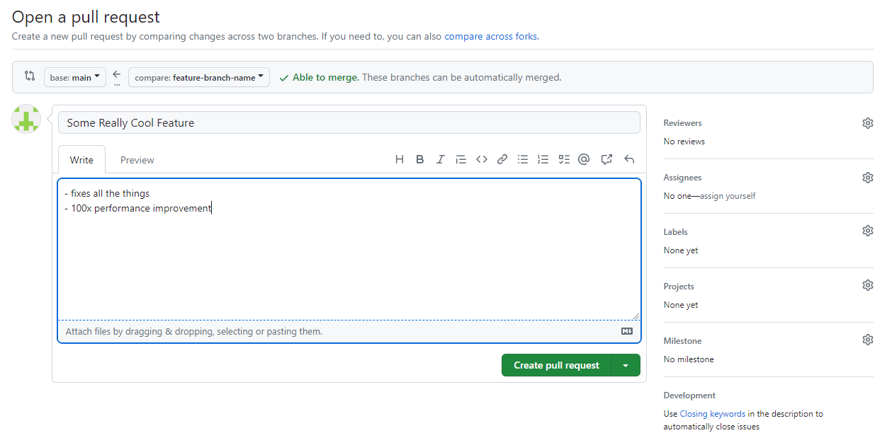

Workflows
---------

.. _development-workflows-clone:

Clone the Repository
^^^^^^^^^^^^^^^^^^^^

The first step of contributing to Undertale is to clone the source code
repository! Run:

.. code-block:: bash

    git clone {repository}

Where ``{repository}`` is the URL for the Undertale repository. See `Cloning a
Repository
<https://docs.github.com/en/repositories/creating-and-managing-repositories/cloning-a-repository>`_.

.. _development-workflows-start-feature:

Start Developing a New Feature or Fix
^^^^^^^^^^^^^^^^^^^^^^^^^^^^^^^^^^^^^

Check out the base branch where you want to start developing your feature
(usually this is ``main``) and pull the latest updates.

.. code-block:: bash

    git checkout main
    git pull

Create a new branch for your feature - name it whatever you want.

.. code-block:: bash

    git checkout -b feature-branch-name

Do some development, make some commits, fix some stuff.

Push your code to a branch on GitHub (and set your local branch up to track it).

.. code-block:: bash

    git push origin feature-branch-name -u

Continue development, push more commits, etc.

When you're finished with your feature or fix...

Open a Pull Request
^^^^^^^^^^^^^^^^^^^

Navigate to the GitHub repo in a browser.

If you recently pushed commits to your feature branch, there will likely be a
yellow box at the top guiding you to open an pull request. If not, switch to
your branch with the branch selector.

Then select Contribute > Open Pull Request on the right.

Add a title for your PR (in Conventional Commit format) and some human-readable
notes about what it does to make life easier for your reviewers, if you want
any (you can also tag reviewers here and they'll get an email).

Create the pull request and you're done!

.. note:: GitHub has a `nice CLI tool <https://cli.github.com/>`_ you
    can use for this if you don't like using a mouse.

Update Your Feature Branch with Upstream Changes
^^^^^^^^^^^^^^^^^^^^^^^^^^^^^^^^^^^^^^^^^^^^^^^^

You've been taking your time developing a super cool new feature - great. But
there are other people contributing code to this repo too, and their code gets
merged into your base branch before you - oh no, conflict!

Luckily, pulling those upstream changes back into your feature branch is easy
with squash merging - just merge their branch into yours. Who cares how messy
the git try gets on individual feature branches, it'll all be squashed when it
gets to ``main``.

First, fetch the latest updates from GitHub - our GitHub remote is called
``origin`` by default if you checked out the code from GitHub originally::

    git fetch origin

Next, make sure you have your feature branch checked out::

    git checkout feature-branch-name

Finally, merge the remote version of your base branch (usually ``main``) into
your current feature branch::

    git merge main

If everything goes smoothly, great! Push your changes and continue with your
day.

If there are merge conflicts, you might have to manually decide how to handle
them - git will tell you this and put you into a nice interactive state where
you can resolve each of the conflicts one at a time.

To see files with conflicts, check the git status::

    git status

Edit those files and resolve the conflicts. When you're done editing a file,
add it to the index to commit::

    git add /path/to/merge-conflict-file-fixed

When you've addressed all the merge conflicts, commit your merge - git will
helpfully create a commit message for you::

    git commit

Now you're up to date. At this point you can push your changes to your remote
feature branch and continue developing.

Merge a Pull Request
^^^^^^^^^^^^^^^^^^^^

We use squash merging to keep a clean, linear git history on main. You can do
this right in the GitHub UI (it should be the only option to merge from the UI
in the GitHub repo).

Navigate to your PR in a browser - at the bottom of the discussion there is a
button to merge (the default should be Squash and Merge).

.. image:: images/pull-request-merge.png

Click squash and merge, or select it from the dropdown if it's not the default.

.. warning:: WAIT! Don't merge it yet. The content of the text you merge
    becomes the commit message on your base branch.

Edit the commit message - to something in Conventional Commit style.

.. image:: images/pull-request-title.png

You should leave the pull request reference that GitHub generates for you at
the end of your commit message - this links the commit on the base branch to
the PR that created it nicely in the GitHub UI.

Confirm the merge. GitHub should delete your feature branch on the remote after
merge automatically. Nice, you merged some code into your base branch.

The last thing we need to do is pull changes into our development environment.
We can check out the base branch (usually main) and pull changes::

    git checkout main
    git pull

Finally, we can delete our feature branch locally now that it's merged::

    git branch -D feature-branch-name

.. note:: squash merging is slightly more complicated to do on the CLI, but
    we'll leave that as an exercise for the reader.

Start Developing a New Feature or Fix That Depends on Another Unmerged Pull Request
^^^^^^^^^^^^^^^^^^^^^^^^^^^^^^^^^^^^^^^^^^^^^^^^^^^^^^^^^^^^^^^^^^^^^^^^^^^^^^^^^^^

Easy, just use a different base branch (i.e., not ``main``) with the
instructions in :ref:`development-workflows-start-feature`.
